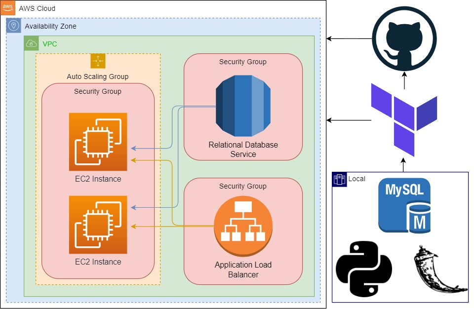

# Phonebook Application deployed on AWS Application Load Balancer with Auto Scaling and Relational Database Service using Terraform

## Description

The Phonebook Application aims to create a phonebook application in Python and deployed as a web application with Flask on AWS Application Load Balancer with Auto Scaling Group of Elastic Compute Cloud (EC2) Instances and Relational Database Service (RDS) using Terraform.

## Project Architecture

## Notes

- Application needs the endpoint of the `dbserver`. We are using Terraform to create a file on GitHub and reading the `dbserver endpoint` from this file within the application.
- We are providing the `repo name` to the `user-data.sh` file dynamically.